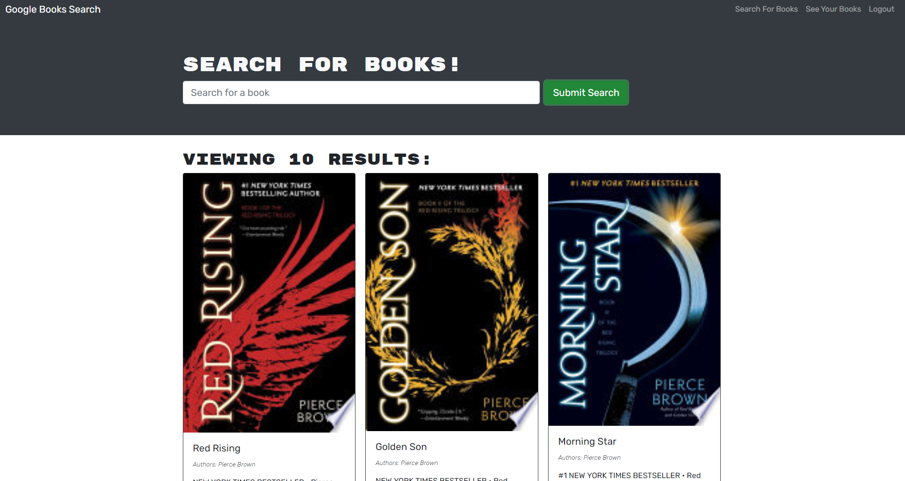
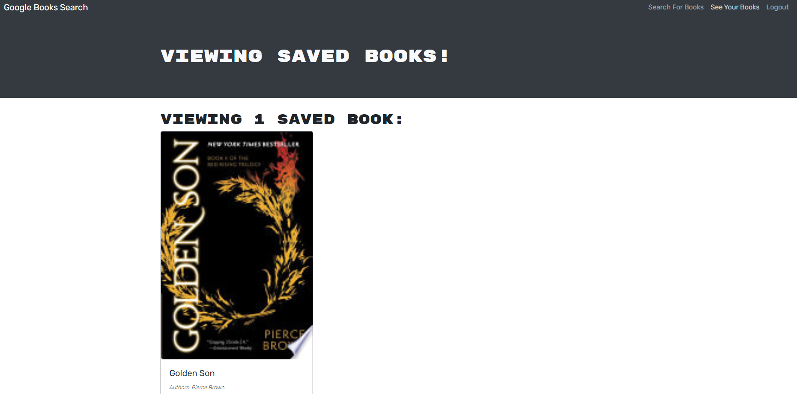

# Book Search Engine
Use the google book search API to search and save books to your personal account

## Table of contents
* [Description](#description)
* [Installation](#installation)
* [Usage and links](#usage)
* [License](#license)
* [Contributors](#contributors)
* [Tests](#tests)
* [Questions](#questions)

## Description

Utilize the google book API to search and find books you like.  Create an account to save and delete favorite books.  Accounts are secured via jsonwebtokens.

Screenshot:

<h4> Home Screen </h4>

<h4> Profile </h4>

## Installation

This application is run via MERN (`MongoDB`, `Express`, `React`, `Nodejs`).

NPM packages required (`npm i` to install all the packages):

Packages used:
<ul>
<li><a href="https://www.npmjs.com/package/express">Express</a></li>
<li><a href="https://www.npmjs.com/package/mongoose">Mongoose</a></li>
<li><a href="https://www.npmjs.com/package/concurrently">Concurrently</a></li>
<li><a href="https://www.npmjs.com/package/graphql">Graphql</a></li>
<li><a href="https://www.npmjs.com/package/bcrypt">bcrypt</a></li>
<li><a href="https://www.npmjs.com/package/jsonwebtoken">jsonwebtoken</a></li>
<li><a href="https://www.npmjs.com/package/apollo-server-express">Apollo-server-express</a></li>
<li><a href="https://reactjs.org/">React</a></li>
<li><a href="https://www.npmjs.com/package/@apollo/client">@apollo/client</a></li>
</ul>

Optional: 
[nodemon](https://www.npmjs.com/package/nodemon)

Run `npm run develop` to start both the client and server on ports 3000 and 3001 respectively.

The graphql playground can be accessed via [localhost](http://www.localhost:3001/graphql)

## Usage

<h4> A video demonstration </h4>

Enter the name of the transactions and their amounts.  Click add funds or subtract funds to record into the database.

Deployed application: [click here.](https://jtn-book-search.herokuapp.com/)

Github repository: [click here.](https://github.com/NguyenJohnnyT/book-search-v2)

## License

This application is licensed under [MIT]((https://opensource.org/licenses/MIT)).

## Contributors

Anyone can contribute to this project.

## Tests

No tests available.

## Questions
Have a question? Please email me at johnnytrucnguyen@gmail.com

[My Github](https://www.github.com/nguyenjohnnyt)